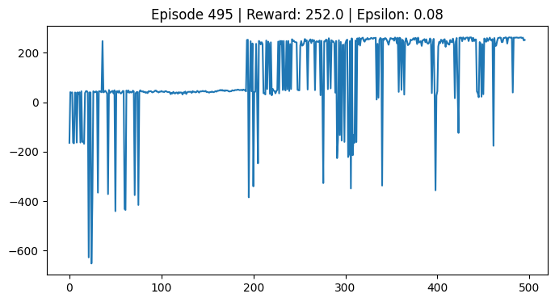

🚁 **Autonomous Drone Path OptimizationAgentic AI | Deep Reinforcement Learning (DQN)**

This project features an autonomous agent trained to navigate a complex grid environment for package delivery. Using Deep Q-Learning, the agent learns to optimize its flight path, avoid obstacles, and successfully return to the depot.

📊 Performance & Results:
The model was trained for 500 episodes, showing clear convergence.
Success Rate: High stability achieved post-episode 200.
Optimized Pathing: The agent learned to prioritize package collection and avoid a -500 reward penalty from obstacles.

Figure 1: Training curve showing the transition from random exploration to reward-maximizing behavior.

🤖 The AI Model
The system utilizes a Deep Q-Network (DQN) architecture-
Algorithm: DQN with Experience Replay and Target Network stabilization.
Environment: Custom OpenAI Gymnasium grid-world (20x20).
State Space: 4D vector (Agent X-Y, Package 1 status, Package 2 status).
Action Space: Discrete (Up, Down, Left, Right, Idle).

📂 Project Structure
env.py: Custom Gymnasium environment defining physics and reward logic.
agent.py: DQN Agent architecture and Replay Buffer implementation.
train.py: Main training loop with live visualization support.
baseline.py: Heuristic-based comparison to validate AI performance.
test_human.py: Manual control interface for environment debugging.
🛠️ Tech StackLanguage: Python 3.11
AI Framework: PyTorchSimulation: Gymnasium, PygameData Science: NumPy, Matplotlib
